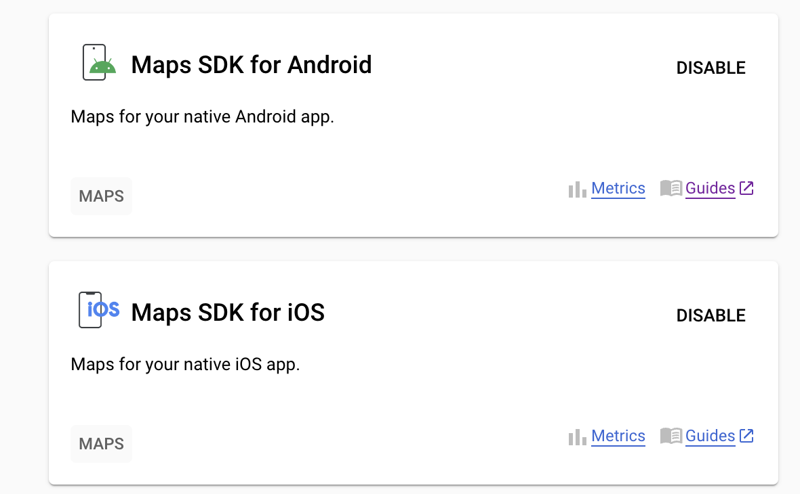

- ios Font 관련해서 중복 발생 문제는 [여기](https://eugenehwang1124.tistory.com/55) 참고하여서 해결함.
- android Font에서 중국어가 표기되는 문제는 [여기](https://github.com/oblador/react-native-vector-icons/issues/1106) 참고하여서 해결함
- react-native-config 이용해서 env 처리는 [여기](https://velog.io/@ddowoo/react-native-%ED%99%98%EA%B2%BD%EB%B3%80%EC%88%98-%EC%84%A4%EC%A0%95%ED%95%98%EA%B8%B0-.env-react-native-config) 참고함

- 이 이미지가 활성화 된 상태였던거임

